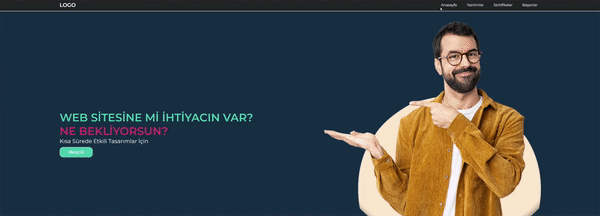

<h1> Udemig </h1>

>Bu proje statik bir web sitesinin HTML ve CSS kullanılarak oluşturulduğu bir örnektir.

<h2> Udemig </h2>

<ul>
<li><b>Anasayfa:</b> Web sitesinin ana sayfası, temel bilgiler ve iletişim butonunu içerir.</li>
<li><b>Yazılımlar</b></li>
<li><b>Sertifikalar</b></li>
<li><b>Başarılar</b></li>
</ul>

<h2> Bölümler </h2>
<ul>
<li>HTML</li>
<li>CSS</li>
<li>Font Awesome</li>

</ul>

